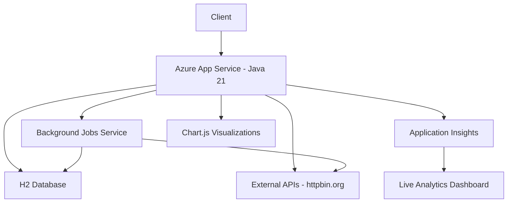

# Java Backend Application Insights Demo

**Enterprise Spring Boot Application with Live Analytics Dashboard**

## 🎯 Overview
This is a **comprehensive ARO (Azure Red Hat OpenShift) demo application** showcasing enterprise-grade observability, monitoring, and analytics capabilities with **Application Insights-style live dashboard** for Mission Critical workloads.

## ✨ Key Features
- **🚀 Spring Boot 3.5.7**: Latest enterprise runtime with Java 21 compatibility
- **📊 Live Analytics Dashboard**: Application Insights-style interface with real-time charts
- **🔍 Azure Application Insights Integration**: Comprehensive telemetry and monitoring
- **🧪 Comprehensive Test Suite**: Latency, CPU, exceptions, dependencies, database errors
- **⚙️ Background Job Processing**: Realistic failure simulation (6.7-12.5% rates)
- **🗄️ Database Operations**: H2 in-memory with entity tracking (ProcessedEntity/SyncEntity)
- **🌐 External API Integration**: Dependency monitoring with httpbin.org
- **📈 Real-time Metrics**: Auto-refreshing trends with 20-point data series

## 🌐 Live Demo
**🎯 Production Application**: https://monitoring-demo-1763185446530.azurewebsites.net

### 📊 Key Dashboards
- **🏠 Basic Dashboard**: https://monitoring-demo-1763185446530.azurewebsites.net/dashboard
- **📈 Live Analytics**: https://monitoring-demo-1763185446530.azurewebsites.net/analytics *(Application Insights-style)*
- **❤️ Health Check**: https://monitoring-demo-1763185446530.azurewebsites.net/health

## 🔗 API Endpoints

### 🧪 Test & Monitoring Endpoints
| Endpoint | Purpose | Response Time | Telemetry Generated |
|----------|---------|---------------|-------------------|
| `/test/latency` | High latency simulation | 2-5 seconds | Request duration metrics |
| `/test/highcpu` | CPU intensive operations | 1-3 seconds | Performance counters |
| `/test/exception` | Exception generation | Immediate | Exception telemetry |
| `/test/dependencyFail` | External API failure | 1-2 seconds | Dependency failure tracking |
| `/test/dbError` | Database error simulation | Variable | Database exception events |
| `/test/stats` | Real-time statistics | Immediate | Current system metrics |
| `/test/entities` | Database entities list | Immediate | Entity count and records |
| **`/test/analytics`** | **Live analytics data** | **Immediate** | **Application Insights-style JSON** |

### 📊 Dashboard Endpoints
| Endpoint | Purpose | Features |
|----------|---------|----------|
| `/` | Home (redirects to dashboard) | Auto-redirect |
| `/dashboard` | Basic monitoring dashboard | Job statistics, entity counts |
| **`/analytics`** | **Live Analytics Dashboard** | **Charts, trends, real-time metrics** |
| `/health` | Application health check | System status |

## 🚀 Quick Start

### 📥 Local Development
```bash
# Prerequisites: Java 21, Maven 3.6+
git clone https://github.com/ssamadda_microsoft/SfMC_Projects.git
cd SfMC_Projects/JavaBackendAppInsights

# Set Application Insights connection string
export APPLICATIONINSIGHTS_CONNECTION_STRING="your-connection-string"

# Build and run
mvn clean package
java -jar target/monitoring-demo-1.0.0.jar

# Access locally
open http://localhost:8080/analytics  # Live Analytics Dashboard
```

### ☁️ Azure Deployment
```bash
# Deploy to Azure App Service
az webapp deploy --resource-group monitoring-demo-1763185446530-rg \
  --name monitoring-demo-1763185446530 \
  --src-path target/monitoring-demo-1.0.0.jar --type jar
```

## 🧪 Testing Examples
```bash
# Generate comprehensive telemetry data
curl https://monitoring-demo-1763185446530.azurewebsites.net/test/latency     # Request duration metrics
curl https://monitoring-demo-1763185446530.azurewebsites.net/test/highcpu     # Performance counters  
curl https://monitoring-demo-1763185446530.azurewebsites.net/test/exception   # Exception telemetry
curl https://monitoring-demo-1763185446530.azurewebsites.net/test/dependencyFail  # Dependency failure

# Monitor real-time data
curl https://monitoring-demo-1763185446530.azurewebsites.net/test/stats       # Basic statistics
curl https://monitoring-demo-1763185446530.azurewebsites.net/test/analytics   # Full analytics JSON
curl https://monitoring-demo-1763185446530.azurewebsites.net/test/entities    # Database entity list
```

## 📊 Live Analytics Dashboard

### 🎨 Application Insights-Style Interface
The `/analytics` endpoint provides a **professional monitoring interface** similar to Azure Application Insights:

- **📥 Incoming Requests**: Rate (req/sec), duration (ms), failure percentage with live trends
- **📤 Outgoing Dependencies**: External API call rates, response times, failure rates  
- **💾 System Resources**: CPU usage, committed memory, exception rates with trend charts
- **🖥️ Server Health**: Active threads, processors, uptime, background job performance
- **🔄 Real-time Updates**: Auto-refreshes every 5 seconds with smooth chart animations

### 📈 Sample Analytics Data
```json
{
  "incomingRequests": {
    "requestRate": { "current": 5.07, "unit": "requests/sec", "status": "healthy" },
    "requestDuration": { "current": 683.53, "unit": "ms", "status": "warning" }
  },
  "overallHealth": {
    "cpuTotal": { "current": 69.29, "unit": "percent", "status": "warning" },
    "backgroundJobs": { "totalJobs": 12, "successRate": 91.7 }
  }
}
```

## 🏗️ Architecture


## 🛠️ Technology Stack
- **Framework**: Spring Boot 3.5.7 with Java 21
- **Database**: H2 in-memory with JPA/Hibernate
- **Job Scheduling**: Quartz Scheduler with realistic failure rates
- **Reactive Programming**: Spring WebFlux for external API calls
- **Template Engine**: Thymeleaf for dashboard rendering
- **Connection Pooling**: HikariCP for database connections
- **Monitoring**: Azure Application Insights 3.6.2
- **Charts**: Chart.js for live analytics visualization
- **Deployment**: Azure App Service Linux with Maven

## 🤖 Background Jobs & Entity Creation

### ⚙️ Automated Background Processing
- **Data Processing**: Every 30 seconds (12.5% failure rate) → Creates **ProcessedEntity** records
- **Data Synchronization**: Every 60 seconds (10% failure rate) → Creates **SyncEntity** records
- **Health Checks**: Every 2 minutes (6.7% failure rate) → System validation

### 🗄️ Database Entity Tracking
Current entities being created and monitored:
```
ProcessedEntity-{jobId}-{timestamp}  (33% job creation rate)
SyncEntity-{jobId}-{timestamp}       (25% job creation rate)
```

## 🎯 Current Deployment Status
✅ **Live Production App**: https://monitoring-demo-1763185446530.azurewebsites.net  
✅ **Spring Boot 3.5.7**: Latest enterprise version deployed  
✅ **Live Analytics Active**: Real-time dashboard with Application Insights-style UI  
✅ **Background Jobs Running**: 12+ jobs executed with realistic failure simulation  
✅ **Database Entities**: 4+ entities created (ProcessedEntity/SyncEntity types)  
✅ **Comprehensive Telemetry**: Full Azure Application Insights integration  
✅ **Enterprise Ready**: Production-optimized configuration with proper logging  

---
*🚀 Part of **SfMC India Team Projects** - Mission Critical ARO Observability Solutions*